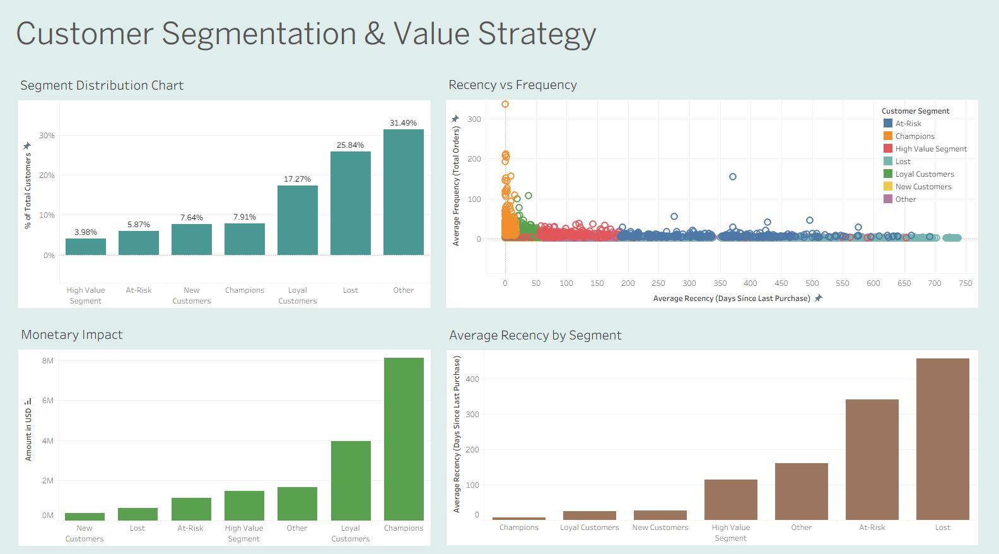

# 🎯 SQL-RFM Customer Segmentation: Retail Value Analysis

This project demonstrates data transformation and advanced SQL techniques to convert raw retail transaction data into an **actionable customer segmentation model**. The goal is to identify high-value segments for strategic marketing and retention campaigns.

## 🛠️ Technical Stack & Tools

* **Database:** PostgreSQL
* **Analysis:** SQL (DQL)
* **Visualization:** Tableau Public
* **Source Data:** Kaggle 'Online Retail II' Dataset

## 💻 Key SQL Techniques Demonstrated

This analysis was executed entirely within a single, optimized SQL script using chained **Common Table Expressions (CTEs)**

### 1. Robust Data Cleaning & Engineering
* **Deduplication:** Utilized the **`ROW_NUMBER()` Window Function** to partition data by transaction keys, eliminating duplicate line items caused by merging two overlapping source files.
* **Data Validation:** Applied rigorous filtering to remove canceled orders (`Invoice NOT LIKE 'C%'`), null customer IDs, and transactions with zero/negative quantities.
* **Data Type Handling:** Successfully managed character encoding issues by enforcing **`LATIN1`** during the `COPY` process.

### 2. Advanced RFM Scoring
* **Recency Calculation:** Used a dynamic subquery to calculate Recency (`DATE_PART('day', MAX_OVERALL - MAX_CUSTOMER)`) against the latest transaction date in the entire dataset.
* **Frequency/Monetary:** Accurately aggregated data using `COUNT(DISTINCT invoice_no)` to count unique orders and `SUM(total_price)` for total lifetime spend.
* **Scoring:** Assigned standardized **1-5 scores** to every customer using the **`NTILE(5)` Window Function**, demonstrating advanced SQL skills.

## 📈 Business Outcome & Key Findings

The analysis segmented the customer base into 7 strategic groups, resulting in the final **`customer_segments`** table, which is ready for direct use by marketing teams.

| Segment | R/F/M Score Profile | Strategic Action |
| :--- | :--- | :--- |
| **Champions** | High (5/5/5) | Reward and retention focus. |
| **Loyal Customers** | High R & F | Offer loyalty programs and upsells. |
| **At-Risk** | Low R, High F | **High-Priority:** Urgent re-engagement campaigns. |
| **Lost** | Low R & F | Re-activation campaigns (lowest priority). |

* **Insight Example:** *The 'Champions' segment, while only ~8% of the base, contributed 45% of total revenue, justifying exclusive treatment.*

## 🔗 Repository Contents

* **`customer_segment.sql`**: The complete, final CTE script used to generate the segments.
* **`customer_segment.csv`**: The exported result set used for visualization.
